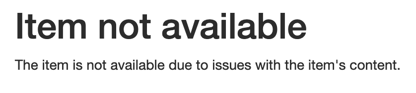
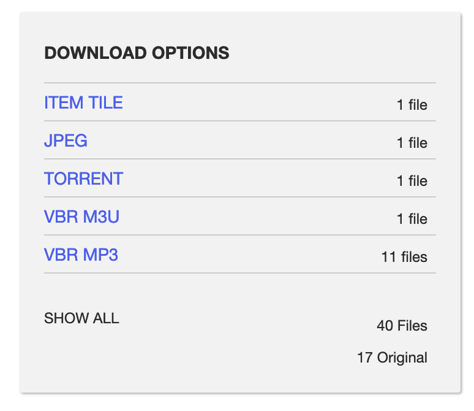

# Archive.org .mp3 Auto-Ripper
archive.org contains a HUGE amount of free and more or less legal .mp3 files. Most of the times you can download them straight from the site. But sometimes you'll be met with this

...shit! But don't worry!! This is where this repo will help you out!!!

## What does it do?
archive.org pages always link to a site which lists links to all downloadable files. Simply copy the content of the "script.js" file into the developer console, a huge line of text will be output. Open the terminal in the folder where you'd like the files to be downloaded into (the terminal of your computer, not the one of your browser), copy and paste the line into the terminal, execute and wait for your download to finish!

## Step by Step
1. navigate to the download linklist of your desired archive.org site (https://archive.org/download/FOLDERNAME), simply click on "SHOW ALL" in the download section

  

2. open the developer tools
3. copy the content of the "script.js" file and paste it into the developer console
4. copy the output of the console
5. open your terminal
6. execute "mkdir FOLDERNAME"
7. execute "cd FOLDERNAME"
8. paste the the console output, execute and wait for your download to finish

## Acknowledgement
the author of this script in no way supports piracy, arrr!!!
